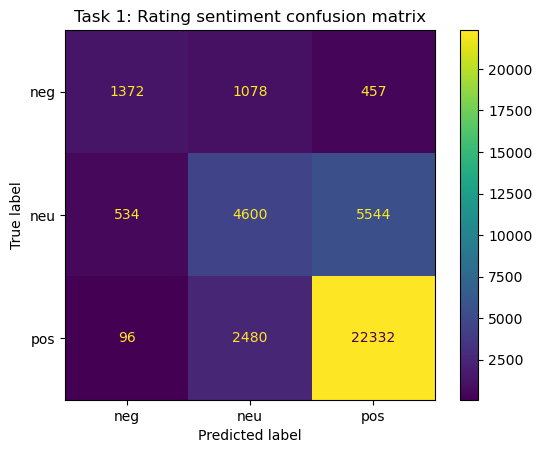
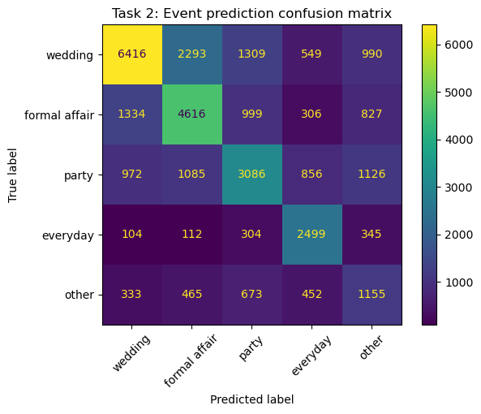
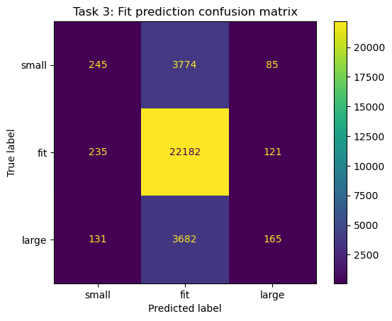

```{=html}
<style>
:root {
  --accent: #D4537E;
  --muted: #8a8a8a;
  --border: #e4e4e4;
  --text: #1a1a1a;
  --bg-light: #fafafa;
}

.rtr-wrap {
  max-width: 860px;
  margin: 0 auto;
  padding: 2rem 1.5rem 5rem;
}

/* Back link */
.back-link {
  display: inline-flex;
  align-items: center;
  gap: 0.35rem;
  font-size: 0.8rem;
  color: var(--muted);
  text-decoration: none;
  text-transform: uppercase;
  letter-spacing: 0.1em;
  margin-bottom: 2rem;
}
.back-link:hover { color: var(--accent); text-decoration: none; }

/* Tag pills */
.tag-row {
  display: flex;
  flex-wrap: wrap;
  gap: 0.4rem;
  margin-bottom: 1.5rem;
}
.tag {
  border: 1px solid var(--border);
  color: var(--muted);
  background: transparent;
  font-size: 0.75rem;
  padding: 0.2rem 0.7rem;
  border-radius: 999px;
  white-space: nowrap;
}

/* Title block */
.project-title {
  font-size: 2rem;
  font-weight: 700;
  line-height: 1.3;
  color: var(--text);
  margin: 0 0 1rem;
}
.project-sub {
  font-size: 1rem;
  color: #5a5a5a;
  line-height: 1.7;
  max-width: 720px;
  margin: 0 0 2rem;
}

/* Metadata row */
.meta-row {
  display: flex;
  flex-wrap: wrap;
  gap: 2rem;
  padding: 1.25rem 0;
  border-top: 1px solid var(--border);
  border-bottom: 1px solid var(--border);
  margin-bottom: 3rem;
}
.meta-item {}
.meta-label {
  font-size: 10px;
  text-transform: uppercase;
  letter-spacing: 0.15em;
  color: var(--muted);
  font-weight: 600;
  display: block;
  margin-bottom: 0.25rem;
}
.meta-value {
  font-size: 0.85rem;
  color: var(--text);
  font-weight: 500;
}
.meta-value a {
  color: var(--accent);
  text-decoration: none;
}
.meta-value a:hover { text-decoration: underline; }

/* Section divider */
.section-hr {
  border: none;
  border-top: 1px solid var(--border);
  margin: 3rem 0;
}
.section-label {
  font-size: 11px;
  text-transform: uppercase;
  letter-spacing: 0.15em;
  color: var(--muted);
  font-weight: 600;
  margin: 0 0 1.75rem;
}

/* Result callout cards */
.results-grid {
  display: grid;
  grid-template-columns: repeat(3, 1fr);
  gap: 1rem;
  margin-bottom: 3rem;
}
.result-card {
  border: 1px solid var(--border);
  border-radius: 4px;
  padding: 1.25rem 1.5rem;
  text-align: center;
}
.result-task {
  font-size: 10px;
  text-transform: uppercase;
  letter-spacing: 0.12em;
  color: var(--muted);
  margin-bottom: 0.5rem;
}
.result-lift {
  font-size: 2rem;
  font-weight: 700;
  color: var(--accent);
  line-height: 1;
}
.result-lift.dim { color: var(--muted); }
.result-desc {
  font-size: 0.75rem;
  color: var(--muted);
  margin-top: 0.35rem;
}

/* Task sections */
.task-section {
  display: grid;
  grid-template-columns: 1fr 1fr;
  gap: 3rem;
  align-items: start;
  margin-bottom: 3.5rem;
}
.task-section.reverse { direction: rtl; }
.task-section.reverse > * { direction: ltr; }

.task-number {
  font-size: 10px;
  text-transform: uppercase;
  letter-spacing: 0.15em;
  color: var(--muted);
  font-weight: 600;
  margin-bottom: 0.5rem;
}
.task-title {
  font-size: 1.2rem;
  font-weight: 700;
  color: var(--text);
  margin: 0 0 0.75rem;
}
.task-desc {
  font-size: 0.875rem;
  color: #5a5a5a;
  line-height: 1.7;
  margin-bottom: 1rem;
}

/* Method pills */
.method-row {
  display: flex;
  flex-wrap: wrap;
  gap: 0.35rem;
  margin-bottom: 1rem;
}
.method-pill {
  border: 1px solid var(--accent);
  color: var(--accent);
  background: transparent;
  font-size: 0.72rem;
  padding: 0.18rem 0.65rem;
  border-radius: 999px;
  white-space: nowrap;
}

/* Key finding callout */
.finding {
  background: var(--bg-light);
  border-left: 3px solid var(--accent);
  padding: 0.85rem 1rem;
  font-size: 0.82rem;
  color: #4a4a4a;
  line-height: 1.6;
  border-radius: 0 4px 4px 0;
}
.finding-label {
  font-size: 9px;
  text-transform: uppercase;
  letter-spacing: 0.12em;
  color: var(--accent);
  font-weight: 700;
  display: block;
  margin-bottom: 0.3rem;
}

/* Task image */
.task-image {
  width: 100%;
  border: 1px solid var(--border);
  border-radius: 4px;
  display: block;
}

/* Results table */
.results-table {
  width: 100%;
  border-collapse: collapse;
  font-size: 0.875rem;
}
.results-table th {
  font-size: 10px;
  text-transform: uppercase;
  letter-spacing: 0.12em;
  color: var(--muted);
  font-weight: 600;
  text-align: left;
  padding: 0.6rem 1rem 0.6rem 0;
  border-bottom: 1px solid var(--border);
}
.results-table td {
  padding: 0.75rem 1rem 0.75rem 0;
  border-bottom: 1px solid var(--border);
  color: var(--text);
}
.results-table .lift-positive { color: var(--accent); font-weight: 600; }
.results-table .lift-flat { color: var(--muted); font-weight: 600; }

/* Reflection cards */
.reflection-grid {
  display: grid;
  grid-template-columns: repeat(3, 1fr);
  gap: 1rem;
}
.reflection-card {
  border: 1px solid var(--border);
  border-radius: 4px;
  padding: 1.25rem;
}
.reflection-icon {
  font-size: 1.1rem;
  margin-bottom: 0.6rem;
  color: var(--accent);
}
.reflection-title {
  font-size: 0.85rem;
  font-weight: 700;
  color: var(--text);
  margin-bottom: 0.4rem;
}
.reflection-desc {
  font-size: 0.8rem;
  color: #5a5a5a;
  line-height: 1.6;
}

@media (max-width: 680px) {
  .results-grid { grid-template-columns: 1fr; }
  .task-section { grid-template-columns: 1fr; }
  .task-section.reverse { direction: ltr; }
  .reflection-grid { grid-template-columns: 1fr; }
  .meta-row { gap: 1rem; }
}
</style>

<div class="rtr-wrap">

  <!-- BACK LINK -->
  <a href="../../projects.html" class="back-link">← All Projects</a>

  <!-- TAGS -->
  <div class="tag-row">
    <span class="tag">Machine Learning</span>
    <span class="tag">NLP</span>
    <span class="tag">Python</span>
    <span class="tag">scikit-learn</span>
    <span class="tag">TF-IDF</span>
  </div>

  <!-- TITLE -->
  <h1 class="project-title">Can a dress review predict if it'll fit?</h1>
  <p class="project-sub">Three prediction tasks on 190,000+ Rent the Runway reviews — using customer language and body metadata to predict sentiment, event type, and fit. The short answer: text is powerful, fit is hard.</p>

  <!-- METADATA -->
  <div class="meta-row">
    <div class="meta-item">
      <span class="meta-label">Type</span>
      <span class="meta-value">Academic · ML</span>
    </div>
    <div class="meta-item">
      <span class="meta-label">Dataset</span>
      <span class="meta-value">190k+ RTR Reviews</span>
    </div>
    <div class="meta-item">
      <span class="meta-label">Models</span>
      <span class="meta-value">Logistic Regression · TF-IDF</span>
    </div>
    <div class="meta-item">
      <span class="meta-label">Project</span>
      <span class="meta-value"><a href="https://rsm-amarkova.github.io/renttherunway/" target="_blank">View Site →</a></span>
    </div>
  </div>

  <!-- RESULTS OVERVIEW -->
  <p class="section-label">Results at a Glance</p>
  <div class="results-grid">
    <div class="result-card">
      <div class="result-task">Task 1 — Sentiment</div>
      <div class="result-lift">+8.9pp</div>
      <div class="result-desc">lift over majority-class baseline</div>
    </div>
    <div class="result-card">
      <div class="result-task">Task 2 — Event Type</div>
      <div class="result-lift">+18.7pp</div>
      <div class="result-desc">lift over majority-class baseline</div>
    </div>
    <div class="result-card">
      <div class="result-task">Task 3 — Fit</div>
      <div class="result-lift dim">+0.2pp</div>
      <div class="result-desc">lift over majority-class baseline</div>
    </div>
  </div>

  <hr class="section-hr">

  <!-- TASK 1 -->
  <div class="task-section">
    <div>
      <div class="task-number">Task 01</div>
      <h2 class="task-title">Predicting Review Sentiment</h2>
      <p class="task-desc">Given only the text of a review, can we classify whether a customer had a positive or negative experience? Reviews were labeled by star rating and modeled as a binary classification problem using bag-of-words features.</p>
      <div class="method-row">
        <span class="method-pill">TF-IDF</span>
        <span class="method-pill">Logistic Regression</span>
        <span class="method-pill">Binary Classification</span>
      </div>
      <div class="finding">
        <span class="finding-label">Key Finding</span>
        Negative reviews are significantly more verbose and fit-focused — customers write more, and more specifically, when something goes wrong.
      </div>
    </div>
    <div>
      
    </div>
  </div>

  <hr class="section-hr">

  <!-- TASK 2 -->
  <div class="task-section reverse">
    <div>
      <div class="task-number">Task 02</div>
      <h2 class="task-title">Predicting Event Type</h2>
      <p class="task-desc">Rent the Runway customers rent for specific occasions. Can the language in a review reveal what kind of event the dress was worn to? This multi-class task tests whether occasion-specific vocabulary is strong enough to classify intent.</p>
      <div class="method-row">
        <span class="method-pill">TF-IDF</span>
        <span class="method-pill">Logistic Regression</span>
        <span class="method-pill">Multi-class</span>
      </div>
      <div class="finding">
        <span class="finding-label">Key Finding</span>
        Formal event language (wedding, gala, black tie) clusters tightly and predicts well. Everyday and vacation categories overlap heavily and drive most of the misclassification.
      </div>
    </div>
    <div>
      
    </div>
  </div>

  <hr class="section-hr">

  <!-- TASK 3 -->
  <div class="task-section">
    <div>
      <div class="task-number">Task 03</div>
      <h2 class="task-title">Predicting Fit</h2>
      <p class="task-desc">The hardest task: predict whether a garment fits as expected, runs small, or runs large. This combines TF-IDF review text with body metadata (height, weight, size, bust, hips) to test whether objective measurements help where language alone falls short.</p>
      <div class="method-row">
        <span class="method-pill">TF-IDF + Body Metadata</span>
        <span class="method-pill">Logistic Regression</span>
        <span class="method-pill">Multi-class</span>
      </div>
      <div class="finding">
        <span class="finding-label">Key Finding</span>
        Adding body measurements barely moves the needle. Fit perception is deeply subjective — the same garment on the same body gets described as both "runs small" and "fits perfectly."
      </div>
    </div>
    <div>
      
    </div>
  </div>

  <hr class="section-hr">

  <!-- FULL RESULTS TABLE -->
  <p class="section-label">Full Results</p>
  <table class="results-table">
    <thead>
      <tr>
        <th>Task</th>
        <th>Baseline Accuracy</th>
        <th>Model Accuracy</th>
        <th>Lift</th>
      </tr>
    </thead>
    <tbody>
      <tr>
        <td>Sentiment</td>
        <td>72.1%</td>
        <td>81.0%</td>
        <td class="lift-positive">+8.9pp</td>
      </tr>
      <tr>
        <td>Event Type</td>
        <td>40.3%</td>
        <td>59.0%</td>
        <td class="lift-positive">+18.7pp</td>
      </tr>
      <tr>
        <td>Fit</td>
        <td>59.8%</td>
        <td>60.0%</td>
        <td class="lift-flat">+0.2pp</td>
      </tr>
    </tbody>
  </table>

  <hr class="section-hr">

  <!-- WHAT I'D DO DIFFERENTLY -->
  <p class="section-label">What I'd Do Differently</p>
  <div class="reflection-grid">
    <div class="reflection-card">
      <div class="reflection-title">Transformer Embeddings</div>
      <p class="reflection-desc">TF-IDF treats words as independent signals. A sentence-level embedding model (e.g. BERT, sentence-transformers) would capture context and nuance — especially useful for fit language like "a bit snug in the shoulders."</p>
    </div>
    <div class="reflection-card">
      <div class="reflection-title">Reframe Fit as a Ranking Problem</div>
      <p class="reflection-desc">Instead of classifying fit into three buckets, treat it as an ordinal or ranking problem. "Runs small → true to size → runs large" has natural ordering that a standard classifier ignores entirely.</p>
    </div>
    <div class="reflection-card">
      <div class="reflection-title">Combined Text + Metadata Features</div>
      <p class="reflection-desc">Body measurements were concatenated as raw features. A better approach would engineer ratio features (e.g. rented size vs. usual size delta) and allow the model to learn interaction terms with text signals.</p>
    </div>
  </div>

</div>
```
